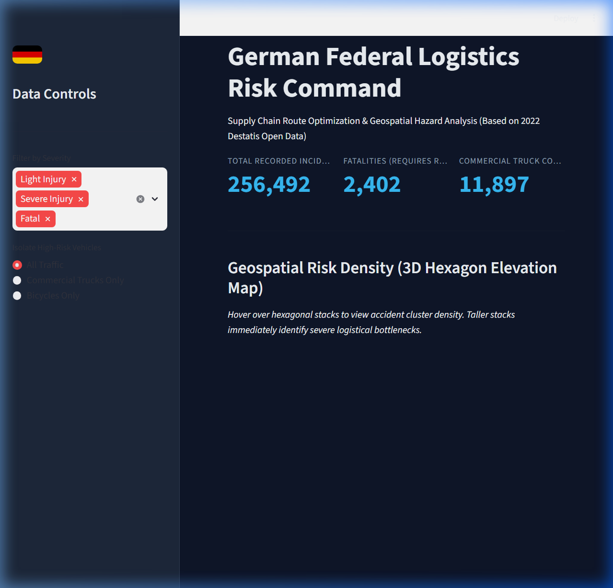

# German Federal Logistics Risk Command

## Executive Summary

This project analyzes 256,492 official traffic accidents recorded by the German Federal Statistical Office (Destatis) in 2022 to identify critical routing hazards for commercial supply chains. By building a custom Python ETL pipeline to project raw UTM coordinates into latitude/longitude, we developed a high-performance spatial SQLite database. The final product is an interactive, C-Suite ready Streamlit web application featuring a PyDeck 3D Hexagon elevation map. This tool enables logistics managers to dynamically filter high-risk zones, ultimately reducing commercial truck collision probability and optimizing European supply chain routing.

## Project Background

**Business Question:** "Which regions in Germany present the highest risk profiles for logistical routing based on historical traffic accident severity, and how can geospatial analysis optimize safe navigation?"

To answer this, the official 2022 *Unfallatlas* (Traffic Accident Atlas) was downloaded from the Mobilithek open data portal. The raw dataset presented significant geospatial engineering challenges, including the need to translate EPSG:25832 coordinates to standard WGS84 for modern mapping libraries. The resulting dashboard was built entirely in Python (Streamlit + Pandas) and adheres to strict monochromatic design principles to ensure data clarity for executive audiences.

## Data Structure & Processing

* **Geospatial Projection:** Leveraged the `pyproj` library to transform Cartesian UTM coordinates into standard GPS formats.
* **Dimensional Translation:** Parsed and translated complex German categorical codes (e.g., 'Fahrrad', 'UKATEGORIE') into English Booleans and severity indicators for international stakeholder comprehension.
* **Spatial Database:** Ingested the validated ~250k rows into a local SQLite database, allowing for targeted SQL aggregation of Fatalities, Truck Collisions, and Temporal (Hour-of-day) hazard zones.

## Strategic Routing Insights

1. **The NRW Hazard Zone:** Nordrhein-Westfalen (NRW) acts as the primary logistical hazard zone with over 53,000 recorded incidents. High-value freight routing through the Ruhr area carries the highest statistical probability of accident-induced delay in Germany.
2. **Afternoon Rush Correlates with Peak Risk:** Commercial truck collisions peak heavily during the afternoon rush hours (14:00 - 17:00). We recommend fleet managers halt non-essential movement during these specific windows to eliminate exposure to peak hazard density.
3. **Urban Bicycle Conflicts:** Analysis identifies a significant volume of specific Truck vs. Bicycle fatalities in dense urban cores during Q3. Delivery schedules within cities like Munich and Berlin must be coupled with mandatory 'Right-Turn Safety' fleet training.

## Actionable Recommendations

* **Dynamic Route Alteration:** Integrate the spatial density insights from the Streamlit 3D map directly into fleet GPS systems to automatically reroute trucks around 'red' hexagon clusters in NRW and Bayern.
* **Schedule Shifting:** Shift all non-perishable B2B freight deliveries to the 04:00 - 10:00 AM window, avoiding the severe 15:00 hazard peak.
* **Insurance Premium Negotiation:** Utilize the isolated spatial risk data to negotiate lower fleet insurance premiums for trucks operating exclusively in low-risk states like Hessen or the northern coast.

## Caveats & Assumptions

* **Temporal Snapshot:** This analysis is strictly bound to 2022 Destatis data. While macro-level hazard zones (like the Ruhr area) remain statistically consistent year-over-year, temporary construction or new infrastructure introduced in 2023/2024 is not reflected.
* **Coordinate Precision:** Approximately 1% of the raw accident records lacked precise X/Y UTM coordinates and were dropped during the cleaning phase. This introduces a negligible, but present, margin of error in spatial density plotting.
* **Weather Isolation:** This current dashboard model isolates risk based on location, vehicle type, and time. Future iterations could incorporate historical precipitation APIs to separate weather-induced anomalies from structural road hazards.
